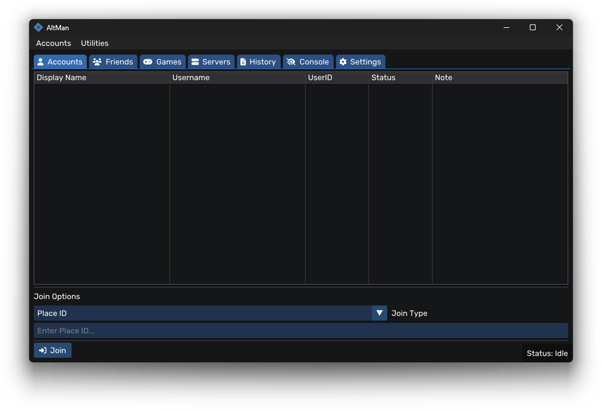

<div align="center">
    
<h1>AltMan</h1>
<h3>Roblox Account Manager & Multi Instance Launcher</h3>
<p><strong>AltMan</strong> is a cross platform Roblox account manager. It lets you store multiple accounts, launch multiple Roblox instances, and switch between accounts without logging in every time.</p>

<p>
    
    
    
</p>
</div>

---

## Features

* **Multi Account Management** – Add, organize, and securely store cookies for multiple Roblox accounts
* **Multi Instance Support** – Launch multiple Roblox instances on the same machine
* **Quick Join** – Join games via JobID, PlaceID, or Private Server Links
* **Friends Integration** – View and manage friends per account
* **Friend Requests** – Send friend requests directly from the interface
* **Server Browser** – Browse active Roblox servers
* **Private Servers**

  * View joinable private servers
  * Manage private servers you own
* **Advanced Filtering** – Filter servers by ping or player count
* **Game Search** – Search Roblox games by title or keyword
* **Log Parser** – Convert Roblox logs into a human readable format
* **Multiple Client Support (macOS only)** – Assign different Roblox clients per account:

  * Default
  * Hydrogen
  * Delta
  * MacSploit

---

## Preview
<div align="center">
  
  <br/>
  <video src="https://github.com/user-attachments/assets/170bb0f1-c5e9-4fa3-8ffd-69185b593448" controls autoplay loop muted width="600"></video>
</div>

---

## Usage Guide

### Adding Accounts

1. Launch **AltMan**
2. Navigate to `Accounts`
3. Click `Add Account` → `Add Via Cookie` or `Add Via Login`
4. Paste your cookie and confirm

### Joining Games

* **By JobID** – Join a specific server instance
* **By PlaceID** – Join a game by place ID
* **By Username** – Join a user's session (if allowed)
* **By Private Server Link** – Join using a private server share link

> You can also join games via the **Servers** or **Games** tabs

### Managing Friends

1. Select an account
2. Open the **Friends** tab
3. Send or manage friend requests

---

## Contributing

Contributions are welcome.

If you want to help:

1.  Fork the repository
2.  Create a branch from `main`
3.  Keep changes small and focused
4.  Follow the existing structure/style
5.  Open a pull request explaining what you changed

Before submitting a PR:

-   Open an issue first for major changes
-   Make sure the project builds
-   Avoid mixing refactors with new features

Bug reports and feature ideas are always welcome.

---

## Requirements

* Windows 10 or 11 (tested on Windows 11 24H2)
* macOS 13.3+
* Active internet connection

---

## Building from Source

### Prerequisites

* Visual Studio 2022 (or Build Tools) with **Desktop development with C++**
* CMake ≥ 3.25
* [vcpkg](https://github.com/microsoft/vcpkg) (set `VCPKG_ROOT`)
* Git

### Clone the repository

```bat
git clone https://github.com/TheRouletteBoi/altman.git
cd altman
```

### Bootstrap vcpkg (if needed)

```bat
git clone https://github.com/microsoft/vcpkg.git %USERPROFILE%\vcpkg
%USERPROFILE%\vcpkg\bootstrap-vcpkg.bat
```

### Install dependencies

```bat
%USERPROFILE%\vcpkg\vcpkg.exe install
```

### Build (Windows)

```bat
mkdir build
cmake -B build -S . ^
  -DCMAKE_TOOLCHAIN_FILE=%USERPROFILE%\vcpkg\scripts\buildsystems\vcpkg.cmake ^
  -A x64 -DCMAKE_BUILD_TYPE=Release
cmake --build build --config Release
```

### Build (macOS)

```bash
mkdir build
cmake -B build -DCMAKE_BUILD_TYPE=Release
cmake --build build --config Release --target AltMan -j 8
```

---

## Security

* Account cookies are stored **locally** and **encrypted** on your machine
* No account data is transmitted to third party servers

## Risk notice

Tools that manage cookies or run multiple Roblox clients can carry risk.

Depending on how they are used they **may violate Roblox Terms of
Service** and could potentially lead to warnings, suspensions, or bans.

AltMan does **not attempt to bypass Roblox security systems**, but you
are responsible for how you use it.

Never share your cookies.

---

<div align="center">
<sub>AltMan • Roblox Account Manager • Multi Instance Launcher</sub>
</div>
